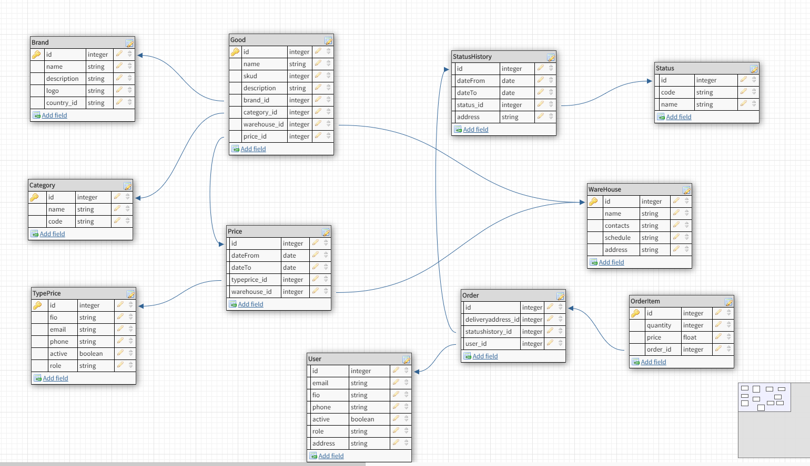

*Проект E-Shop*

Проект создан в рамках обучения курса Otus. Архитектор ПО
и представляет собой web-приложение на основе микросервисной архитектуры.

Архитектурная схема представлена ниже.

Технологический стек Spring/Spring Boot. В качестве базы данных используется PostgreSQL
Для входа в приложение используются следующие параметры
|===
|Параметр |Значение

|Администратор|admin@mail.ru/12345
|Пользователь |test2@mail.ru/12345
|Точка входа  |http://localhost:8082/swagger-ui.html
|===

На первом этапе созданы следующие сущности
|===
|Пользователь
|Товар
|Заказ
|Корзина (Корзина в настоящий момент считается заказом с особым статусом)
|===

Модель данных представлена ниже

Архитектурно проект разделен на следующие микросервисы
У всех сервисов выведен стандартный url актуатора /actuator/health для контроля

- *Config Service*              http://localhost:7777 централизованное хранилище конфигураций
- *Authentication Service*      http://localhost:9999 сервис авторизации пользователей
- *Catalog Service*             http://localhost:8082 сервис предоставляет информацию о товарах. Порт 8082
- *Basket Service*              http://localhost:8083 сервис предоставляет информацию о корзине товаров
- *Admin Service*               http://localhost:8081 сервис выполняет административные функции
- *CreateSchema Service*        сервис создает и заполняет структуры данных
- *Order Service*               http://localhost:8084 сервис выполняет обработку заказов
- *Notification Service*        http://localhost:8086 сервис позволяет уведомлять пользователей о событиях в системе
- *Registration Service*        http://localhost:8085 сервис обеспечивает регистрацию пользователей

Для авторизации используется jwt-авторизация

Все методы GET для Country, Good, WareHouse открыты для всех сущностей открыты всем пользователям
Методы, изменяющие справочники, открыты администраторам системы
Методы, изменяющие заказы, открыты самому пользователю

Во втором ДЗ добавлены два сервиса для отправки уведомлений: PushService и EmailService
Каждый из сервисов получает свои параметры

*PushService*
|===
|Параметр |Значение
|phone|Номер телефона
|text|Сообщение
|===

*EmailService*
|===
|Параметр |Значение
|to|Адресат
|subject|Заголовок письма
|text|Текст письма
|===

Для вызова этих сервисов сделан общий сервис SendMessage и контроллер MessageController

Первый элемент вызова котроллера - тип события push/email

Второй элемент - массив свойств из таблиц указанных выше

Сборка проекта mvn clean package
Запуск докера docker-compose up

Для тестирования представлены некоторые примеры запросов, выполненных в SOAPUI в файлах *soapui-project.xml
Токены создаются в файлах get_admin_token.bat get_token.bat
Примеры запуска API с помощью curl представлены в файлах run_add_item.bat run_basket.bat
Тестировано в среде Docker for Windows 10.

*Четвертое домашнее задание*

Добавлено шардирование на примере заказов, выбираемых в сервисе catalog.
Внутри одной базы данных созданы три однотипных таблицы
goods_msk   для товаров, которые находятся в Москве
goods_spb   для товаров, которые находятся в Санкт-Петербурге
goods_oth   для товаров, которые находятся в других городах

Для построения ORM-модели используется нотация MappedSuperClass в классе Good,
от которого унаследованы три независимых класса GoodMsk, GoodProvincial, GoodSpb

По адресу залогиненного пользователя определяется одна из таблиц, в которой уже потом проводится и сам поиск.
Если пользователь не залогинен, то поиск производится по всем таблицам.
Можно рассмотреть вариант передачи в конроллер город для конкретизации поиска в качестве отдельного параметра.
Пользователь может искать товары с доставкой в город, в котором он не проживает.

Точки входа сервиса изменили номер версии на v2 и стали /microservices/v2
Таким образом мы сразу разделяем шардированный сервис от обычного.
Я не стал проводить по всей программе изменения сознательно так как проект учебный

*Пятое домашнее задание*

Для распределенного кеширования используется Hazelcast.
*hzServerNode* добавлен исключительно для обучения. В связи с этим сервис не включен в докеризацию.

Было интересно как пишется серверная часть hazelcast.

*hzCatalog* http://localhost:8090 сервис обеспечивает кеширование запросов к сервису Catalog и реализован в виде sidecar
Точки входа сервиса изменили номер версии на v3 и стали /microservices/v3.
Обратите внимание, что общедоступными оставил список категорий и брендов товаров и складов.
Список товаров требует авторизации. Это сделано в учебных целях.
Было интересно попробовать передавать jwt-токен другому сервису.
При работе hzCatalog выводит в выходной поток информацию о том, где были взяты значения в БД или в кеше.
В конфигурационном файле можно задавать время жизни распределенной мапы.

*Шестое домашнее задание*
*Notification Service* переведен на асинхронную работу.

При регистрации пользователя(Registration Service) отправляется сообщение в RabbitMQ.
В свою очередь Notification Service получает сообщение из очереди и отправляет приветственное письмо
пользователю по электронной почте.

*Седьмое домашнее задание*
Добавлена работа с prometheus-grafana. Порты стандартные http://grafana:3000

